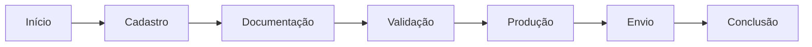
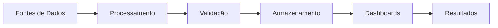

# 👋 Ronaldo Lima

## Gestão de Dados • Processos • Cadastros • Automação

Profissional com **13 anos de experiência no IEPTB-SP**, atuando na organização de cadastros, documentação, dados, planilhas e processos operacionais relacionados ao envio de protestos.

> **Meu objetivo neste portfólio é transformar experiência operacional em soluções digitais, organizadas, mensuráveis e automatizadas.**

---

## 🎯 Sobre mim

- 🗂️ Gestão e controle de cadastros
- 🏢 Cadastro de empresas, bancos, prefeituras e condomínios
- 📊 Organização e tratamento de grandes bases de dados
- 📑 Conferência e vinculação de documentação
- 📈 Controle e manutenção de planilhas
- 🔄 Acompanhamento de processos operacionais
- 🔐 Tratamento responsável de informações sensíveis
- 🧩 Organização de bases de governos e CNPJs
- 🤝 Interface com áreas de gestão e superintendência
- ⚙️ Busca por automação e melhoria de processos

---

## 💼 Currículo

### IEPTB-SP — 13 anos

Atuação em processos de cadastro e operação de empresas, bancos, prefeituras e condomínios conveniados para envio de protestos.

**Principais responsabilidades:**

| Área | Atuação |
|---|---|
| Cadastros | Inclusão, atualização e controle de registros |
| Plataformas | Operação em quatro plataformas de protesto |
| Documentação | Conferência e vinculação de documentos |
| Dados | Organização, tratamento e validação de bases |
| Planilhas | Controle, atualização e consolidação |
| Processos | Acompanhamento até o início da produção |
| Governos | Organização de bases e classificação de CNPJs |
| Gestão | Interface com áreas responsáveis e superintendência |

### 📄 Currículo completo

➡️ **[Ver meu currículo](CURRICULO.md)**

---

## 🚀 Projetos do portfólio

### 01 · 🗂️ Sistema de Controle de Cadastros
Estrutura para controlar cadastros, documentos, pendências, status e histórico.

**Foco:** gestão operacional · organização · rastreabilidade

➡️ [Ver projeto](projetos/01-controle-cadastros/README.md)

### 02 · 📊 Dashboard de CNPJs e Governos
Organização e classificação de bases fictícias de CNPJs e categorias de governo.

**Foco:** dados · classificação · indicadores

➡️ [Ver projeto](projetos/02-dashboard-cnpjs-governos/README.md)

### 03 · ⚙️ Automação de Planilhas
Automação de tarefas repetitivas de limpeza, padronização, consolidação e geração de relatórios.

**Foco:** produtividade · automação · qualidade

➡️ [Ver projeto](projetos/03-automacao-planilhas/README.md)

### 04 · 🔄 Controle de Fluxo de Protestos
Modelo visual para acompanhar etapas, pendências, prazos e conclusão de processos.

**Foco:** processos · controle · indicadores

➡️ [Ver projeto](projetos/04-fluxo-protestos/README.md)

### 05 · 🔎 Validador de CNPJ
Projeto didático para validação estrutural e apoio à qualidade de bases cadastrais.

**Foco:** validação · qualidade de dados · automação

➡️ [Ver projeto](projetos/05-validador-cnpj/README.md)

### 06 · 📈 Dashboard Operacional
Painel para acompanhar produtividade, cadastros, pendências e evolução por período.

**Foco:** indicadores · análise · gestão

➡️ [Ver projeto](projetos/06-dashboard-operacional/README.md)

---

## 🧠 Competências

**Gestão de dados**  
Organização, classificação, conferência, padronização e controle de informações.

**Processos**  
Mapeamento de etapas, identificação de pendências e acompanhamento operacional.

**Planilhas e análise**  
Estruturação de bases, consolidação, filtros, relatórios e indicadores.

**Automação**  
Identificação de tarefas repetitivas e transformação em fluxos automatizados.

**Documentação**  
Conferência, organização e vinculação de documentos aos respectivos cadastros.

---

## 🛠️ Tecnologias e ferramentas

Excel · Python · Pandas · SQL · Power BI · Git · GitHub · Mermaid

---

## 🔄 Fluxo de trabalho

---

## 🏗️ Arquitetura dos projetos

---

## 🔐 Compromisso com segurança

Todos os exemplos deste portfólio são **fictícios ou anonimizados**.

Não são publicados dados reais de empresas, CNPJs utilizados em operações internas, documentos, credenciais ou informações confidenciais.

---

## 💡 Próximos projetos

- 🌐 Aplicação web para controle de cadastros
- 🔌 APIs para integração e validação de dados
- 📧 Automação de e-mails e notificações
- 🤖 IA para classificação de documentos
- 🔔 Sistema de alertas de pendências e prazos
- 📱 Aplicação para acompanhamento de processos

---

## 📌 Resumo profissional

**Ronaldo Lima**  
Gestão de Dados • Processos • Cadastros • Automação

Este portfólio representa a evolução de uma experiência prática em operações e dados para uma abordagem cada vez mais orientada a **tecnologia, automação, análise e melhoria contínua**.

---

⭐ **Obrigado por visitar meu portfólio.**